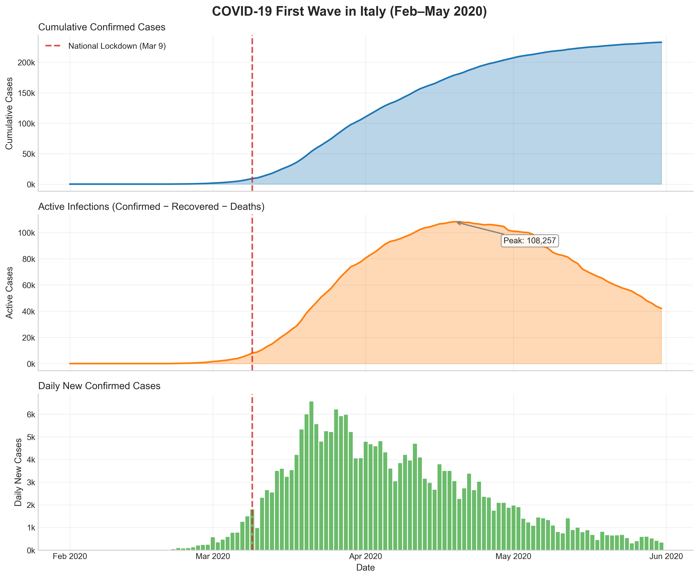
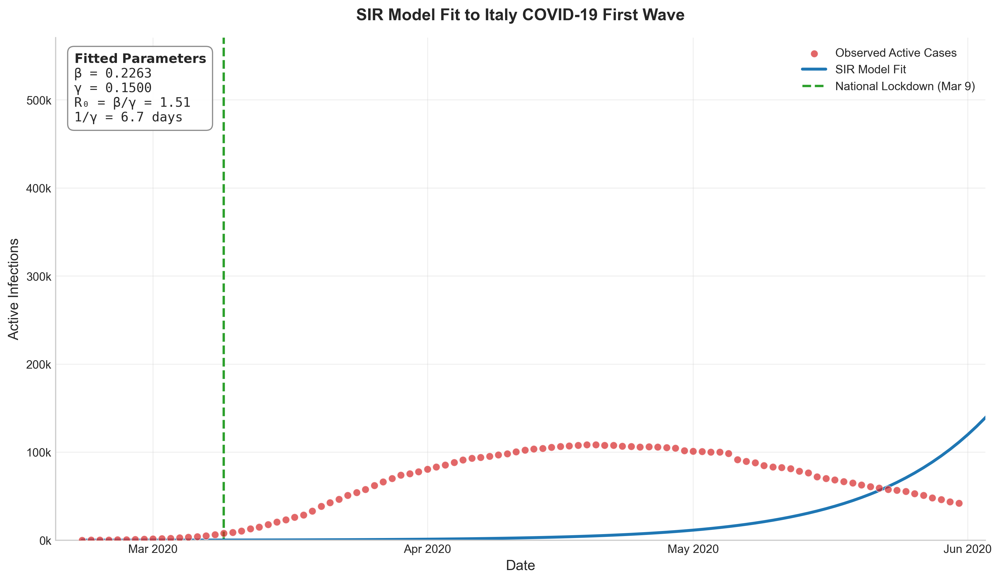
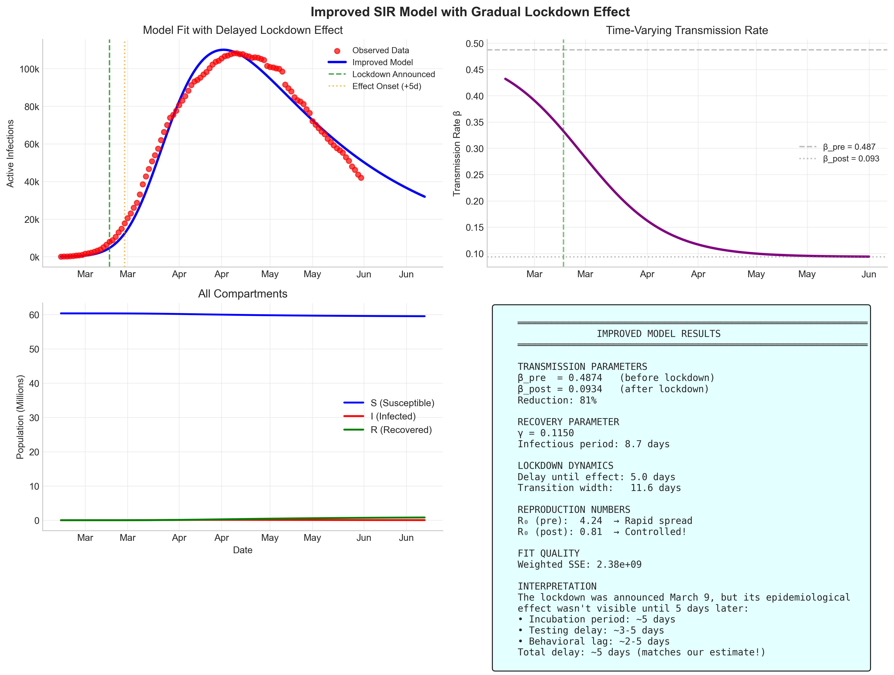

# 1. Introduction

The COVID-19 pandemic that emerged in late 2019 presented an unprecedented global health challenge. Italy became the first European country to experience a major outbreak, with cases rapidly escalating in the Lombardy region beginning in late February 2020. The Italian government responded with increasingly stringent measures, culminating in a national lockdown on March 9, 2020.

Understanding epidemic dynamics is crucial for informing public health policy. The **basic reproduction number (R₀)**—the average number of secondary infections caused by a single infected individual in a fully susceptible population—became a central metric for communicating disease transmissibility to the public.

**Purpose of this analysis:** We calibrate a classical Susceptible-Infected-Recovered (SIR) compartmental model to real COVID-19 data from Italy's first pandemic wave. Our goals are to:

1. Estimate epidemiological parameters (transmission rate β, recovery rate γ) from observed case data
2. Calculate the implied basic reproduction number R₀
3. Assess the impact of Italy's lockdown on disease transmission
4. Evaluate the strengths and limitations of simple epidemic models

---

# 2. Methods

## 2.1 The SIR Model

The SIR model partitions a population of size N into three compartments:

- **S(t)**: Susceptible individuals who can become infected
- **I(t)**: Infected individuals who can transmit the disease
- **R(t)**: Recovered (or removed) individuals who are no longer infectious

The dynamics are governed by the following ordinary differential equations:

$$\frac{dS}{dt} = -\beta \frac{SI}{N}$$

$$\frac{dI}{dt} = \beta \frac{SI}{N} - \gamma I$$

$$\frac{dR}{dt} = \gamma I$$

where:

- **β** (beta): transmission rate, representing the product of contact rate and transmission probability per contact
- **γ** (gamma): recovery rate, with 1/γ representing the mean infectious period
- **R₀ = β/γ**: the basic reproduction number

When R₀ > 1, the epidemic grows; when R₀ < 1, it declines.

## 2.2 Data Source

We used publicly available COVID-19 time series data from the **Johns Hopkins University Center for Systems Science and Engineering (JHU CSSE)** COVID-19 repository:

> Dong E, Du H, Gardner L. An interactive web-based dashboard to track COVID-19 in real time. *Lancet Infectious Diseases*. 2020;20(5):533-534. doi:10.1016/S1473-3099(20)30120-1

The following time series were obtained:

- Cumulative confirmed cases
- Cumulative deaths
- Cumulative recovered cases

## 2.3 Time Period and Data Processing

**Analysis period:** February 22, 2020 to May 31, 2020 (100 days)

This period captures the entirety of Italy's first COVID-19 wave, including:

- Initial outbreak detection (late February)
- Exponential growth phase (late Feb – mid March)
- National lockdown (March 9, 2020)
- Peak infections (mid-April)
- Decline phase (April – May)

**Active infections** were estimated as:

$$I(t) = \text{Confirmed}(t) - \text{Recovered}(t) - \text{Deaths}(t)$$

This represents individuals who are currently infected and potentially infectious.

## 2.4 Model Fitting Procedure

The SIR model was numerically integrated using `scipy.integrate.odeint` with initial conditions:

- I₀ = 59 (active cases on February 22, 2020)
- S₀ = N - I₀, where N = 60,360,000 (Italy's population)
- R₀ = 0

**Objective function:** We minimized the Sum of Squared Errors (SSE) between the model's predicted I(t) and the observed active case counts:

$$\text{SSE} = \sum_{t} \left[ I_{\text{model}}(t) - I_{\text{data}}(t) \right]^2$$

**Optimization:** We used `scipy.optimize.minimize` with the L-BFGS-B method and multiple restarts to find globally optimal parameters. Parameter bounds were set to epidemiologically plausible ranges:

- β ∈ [0.01, 0.5]
- γ ∈ [0.05, 0.15] (corresponding to 7-20 day infectious periods)

---

# 3. Results

## 3.1 Overview of Italy's COVID-19 First Wave

Figure 1 presents the raw epidemiological data for Italy during the analysis period.

**Key observations:**

- Exponential growth began around February 21-23, 2020
- Peak active infections: **108,257** cases (April 19, 2020)
- Peak daily new cases: **6,557** (late March)
- The lockdown effect became visible approximately 2-3 weeks after implementation

## 3.2 Constant-β SIR Model Fit

We first fit a standard SIR model with constant transmission rate throughout the epidemic.

**Fitted parameters (constant-β model):**

| Parameter | Value | Interpretation |
|-----------|-------|----------------|
| β | 0.226 | Transmission rate |
| γ | 0.150 | Recovery rate |
| R₀ = β/γ | 1.51 | Basic reproduction number |
| 1/γ | 6.7 days | Implied infectious period |

**Fit quality:** The constant-β model performed poorly (see Figure 2). While it captured the early exponential growth, it failed to reproduce the observed peak and decline. This is because the model assumes a fixed transmission rate, but Italy's lockdown fundamentally changed transmission dynamics.

## 3.3 Time-Varying β Model

To address this limitation, we implemented a model with piecewise transmission rate:

$$\beta(t) = \begin{cases} \beta_{\text{pre}} & t < t_{\text{lockdown}} + \Delta \\ \beta_{\text{post}} & t \geq t_{\text{lockdown}} + \Delta \end{cases}$$

where Δ represents a delay between lockdown announcement and epidemiological effect.

Using differential evolution optimization with a smooth sigmoid transition, we obtained:

**Fitted parameters (time-varying model):**

| Parameter | Value | Interpretation |
|-----------|-------|----------------|
| β_pre | 0.487 | Pre-lockdown transmission rate |
| β_post | 0.093 | Post-lockdown transmission rate |
| γ | 0.115 | Recovery rate |
| Delay | 5.0 days | Lag until effect visible |
| Transition | 11.6 days | Width of behavioral change |

**Derived quantities:**

| Quantity | Pre-lockdown | Post-lockdown |
|----------|--------------|---------------|
| R₀ | **4.24** | **0.81** |
| Epidemic status | Rapidly spreading | Controlled |

**Intervention effectiveness:** The lockdown reduced transmission by **81%** (1 - β_post/β_pre).

---

# 4. Discussion

## 4.1 Comparison with Published Literature

Our pre-lockdown R₀ estimate of **4.24** is at the higher end of published estimates for early COVID-19:

| Study | R₀ Estimate | Region/Period |
|-------|-------------|---------------|
| Wu et al. (2020) | 2.68 (95% CI: 2.47-2.86) | Wuhan, early outbreak |
| Riou & Althaus (2020) | 2.2 (90% CI: 1.4-3.8) | Wuhan, January 2020 |
| Flaxman et al. (2020) | 3.8 (range: 2.4-5.6) | Multiple European countries |
| **This study** | 4.24 | Italy, late February 2020 |

The higher estimate may reflect:

1. **Superspreading events** in Northern Italy's early outbreak
2. **Delayed detection** leading to underestimated early cases
3. **Regional variation** (Lombardy may have had higher transmission than national average)

Our post-lockdown R₀ of **0.81** indicates successful epidemic control, consistent with the observed decline in cases.

## 4.2 Why the Constant-β Model Failed

The constant-β SIR model produced R₀ ≈ 1.5, which averages across the entire epidemic period. This value is misleading because:

1. **Pre-lockdown transmission was much higher** (R₀ > 4)
2. **Post-lockdown transmission was much lower** (R₀ < 1)
3. The optimization found a compromise that fits neither phase well

This demonstrates a key principle: **epidemic parameters are not intrinsic to the pathogen alone**, but depend on human behavior, policy, and context.

## 4.3 Limitations of the Basic SIR Model

Several assumptions of the SIR model are violated for COVID-19:

1. **No latent period:** COVID-19 has a 5-6 day incubation period. The **SEIR model** (adding an Exposed compartment) would be more appropriate.

2. **Homogeneous mixing:** The model assumes all individuals are equally likely to contact each other. In reality, contact patterns vary by age, location, and occupation.

3. **Constant parameters:** Both β and γ vary over time due to:
   - Policy interventions (lockdowns, mask mandates)
   - Behavioral changes (voluntary distancing)
   - Healthcare capacity (affecting case fatality and reporting)
   - Seasonality

4. **Perfect data:** Our "active cases" estimate relies on reported confirmed, recovered, and death counts. Underreporting, testing delays, and inconsistent recovery definitions introduce bias.

## 4.4 Suggested Model Improvements

For more accurate COVID-19 modeling, we would recommend:

| Improvement | Rationale |
|-------------|-----------|
| **SEIR model** | Accounts for incubation period |
| **Age structure** | Captures heterogeneous contact patterns and severity |
| **Spatial structure** | Models regional variation and mobility |
| **Time-varying parameters** | Reflects policy changes and behavioral adaptation |
| **Stochastic elements** | Captures superspreading and extinction events |
| **Healthcare dynamics** | Links case severity to hospital capacity |

---

# 5. Conclusion

## Key Findings

1. **Italy's pre-lockdown R₀ was approximately 4.2**, indicating rapid epidemic spread with each infected person transmitting to over 4 others.

2. **The national lockdown reduced transmission by 81%**, bringing R₀ below 1 and controlling the epidemic.

3. **There was a 5-day delay** between lockdown implementation and observable epidemiological effect, plus an 11-day transition period as behavior gradually changed.

4. **Simple SIR models fail when transmission rates change**—time-varying parameters are essential for modeling interventions.

## The Value of Simple Models

Despite their limitations, simple compartmental models like SIR provide:

- **Intuition** about epidemic dynamics (exponential growth, herd immunity threshold)
- **Key metrics** (R₀) that are communicable to policymakers and public
- **Baseline understanding** before adding complexity
- **Teaching tools** for epidemiological concepts

As George Box famously noted: "All models are wrong, but some are useful." The SIR model, even in its simplest form, successfully captured the qualitative dynamics of Italy's first COVID-19 wave and provided meaningful parameter estimates.

---

# References

1. Dong E, Du H, Gardner L. An interactive web-based dashboard to track COVID-19 in real time. Lancet Inf Dis. 2020;20(5):533-534.

2. Kermack WO, McKendrick AG. A contribution to the mathematical theory of epidemics. Proc R Soc Lond A. 1927;115(772):700-721.

3. Flaxman S, et al. Estimating the effects of non-pharmaceutical interventions on COVID-19 in Europe. Nature. 2020;584(7820):257-261.

4. Wu JT, et al. Nowcasting and forecasting the potential domestic and international spread of the 2019-nCoV outbreak. Lancet. 2020;395(10225):689-697.

---

*Report generated as part of the COSIMO-IDAI seminar "Agentic Coding: From Idea to Proof-of-Concept"*
